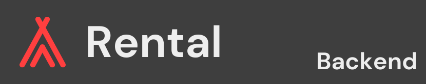

# The Project

## Tech Stack

- Codebase: JavaScript.

- Frontend: React.js, Redux-Toolkit.js and Sass.

- Backend: Express.js, Passport.js and JSON Web Token.

  - Database: PostgreSQL and Sequelize.

## Team

- Full Stack Developers: Facundo Casabella and Nicolas Cohen.

- Frontend Developers: Ernesto Abril, Tomás Lleonart and José Chavarría.

- Backend Developers: Mariano Duhalde, Mauro Reyna and Lucas Novoa.